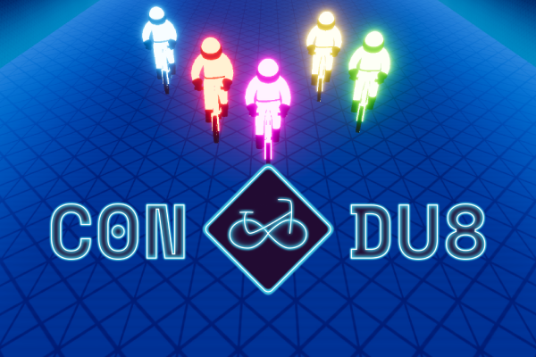

<!-- <h1 style="text-align: center;"> Résonance</h1>
<h1 style="text-align: center;"> Expérience multimédia TIM 2025</h1> -->

    <video autoplay loop muted playsinline>
        <source src="./medias/resonanceBanner.mp4" type="video/mp4">
    </video>

<h3 style="text-align: center;">Résonance évoque un écho, une interaction qui se propage et transforme ce qui l’entoure. Qu’elle soit sonore, visuelle, émotionnelle ou philosophique, elle tisse des liens entre les êtres, les idées et les environnements.
</h3>

<h4 style="text-align: center;">Ce thème guide l’exposition des finissants et finissantes du programme <a href="https://tim-montmorency.com/" style="text-decoration: none;">techniques d’intégration multimédia du Collège Montmorency</a>. Chaque projet explore la résonance sous un angle unique, qu’il s’agisse d’interactions humaines, de réflexions sur la nature ou d’ondes émotionnelles. À travers des œuvres vivantes et interactives, où la végétation occupe une place marquante, ils et elles invitent le public à ressentir l’écho de chaque interaction.
</h4>

* 
* 
* 
* 
* 
* 
* 

